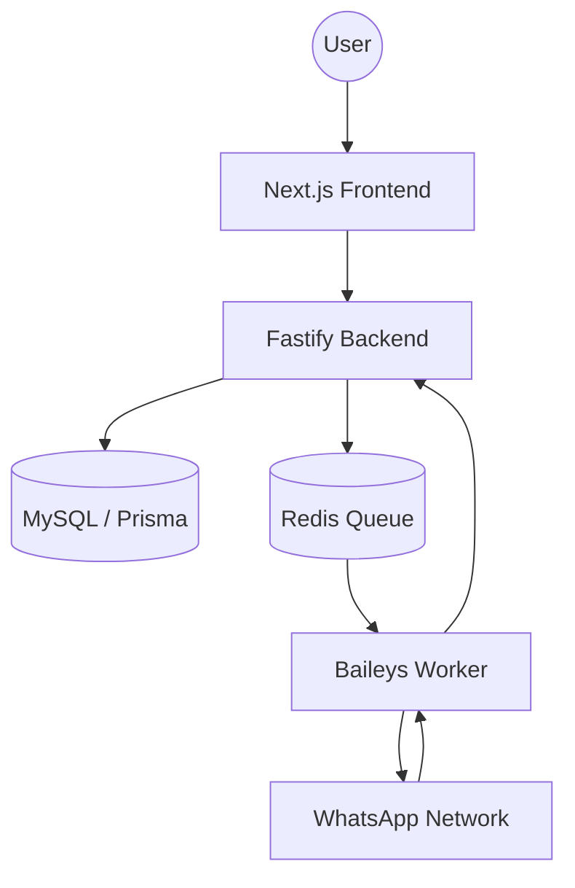

# 🚀 Whatsappin Documentation

Selamat datang di dokumentasi resmi **Whatsappin (SaaS)**. Sistem ini dirancang untuk menyediakan layanan pengiriman pesan WhatsApp yang skalabel, aman, dan mudah diintegrasikan dengan berbagai platform melalui REST API dan Webhook.

---

## 🏗️ Arsitektur Sistem

Proyek ini menggunakan arsitektur modern berbasis micro-services (atau modular monolith) yang dipisahkan antara logika bisnis, pengolahan pesan, dan antarmuka pengguna.

---

## 🏁 Memulai (Getting Started)

Ikuti panduan di bawah ini untuk menyiapkan lingkungan pengembangan atau produksi Anda:

1.  **[🚀 Instalasi](INSTALLATION.md)**: Persyaratan sistem dan langkah-langkah setup awal.
2.  **[⚙️ Konfigurasi](CONFIGURATION.md)**: Detail pengaturan environment variable (`.env`).
3.  **[▶️ Menjalankan Sistem](RUNNING.md)**: Cara menjalankan backend, frontend, dan worker.
4.  **[📖 Panduan Penggunaan](USAGE.md)**: Langkah pertama setelah sistem berjalan.

---

## ✨ Fitur Unggulan

Telusuri detail fitur yang tersedia di sistem ini:

-   **[📱 Manajemen Device](features/DEVICES.md)**: Menghubungkan banyak akun WhatsApp sekaligus (Multi-Device).
-   **[🤖 Auto-Responder (Built-in AI)](features/AUTO_RESPONDER.md)**: Balas pesan otomatis menggunakan Keyword atau AI (Gemini, OpenAI, Claude).
-   **[🚀 Message Blast](features/BLAST.md)**: Kirim pesan massal terjadwal dengan filter grup/tag.
-   **[💬 Live Chat](features/LIVE_CHAT.md)**: Antarmuka chat satu pintu untuk semua device yang terhubung.
-   **[📋 Contact Management](features/CONTACTS.md)**: Pengelolaan kontak dengan sistem Group dan Tagging.
-   **[🔌 Webhooks & API](features/WEBHOOKS.md)**: Integrasikan sistem Anda dengan event WhatsApp secara real-time.

---

## 🛠️ Developer Resources

-   **[🔌 Referensi API](API.md)**: List endpoint lengkap beserta contoh request/response.
-   **[👨‍💻 Panduan Developer](DEVELOPER_GUIDE.md)**: Struktur folder dan best practice pengembangan.
-   **[🔮 Roadmap Fitur](ROADMAP.md)**: Daftar fitur yang sedang dalam pengembangan.

---

## 📄 Lisensi

Dibuat dengan ❤️ oleh tim pengembang untuk komunitas.

[Kembali ke Beranda Utama](../README.md)
